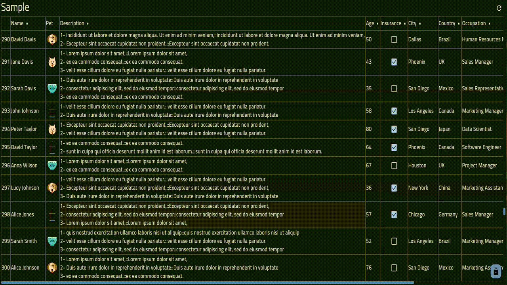
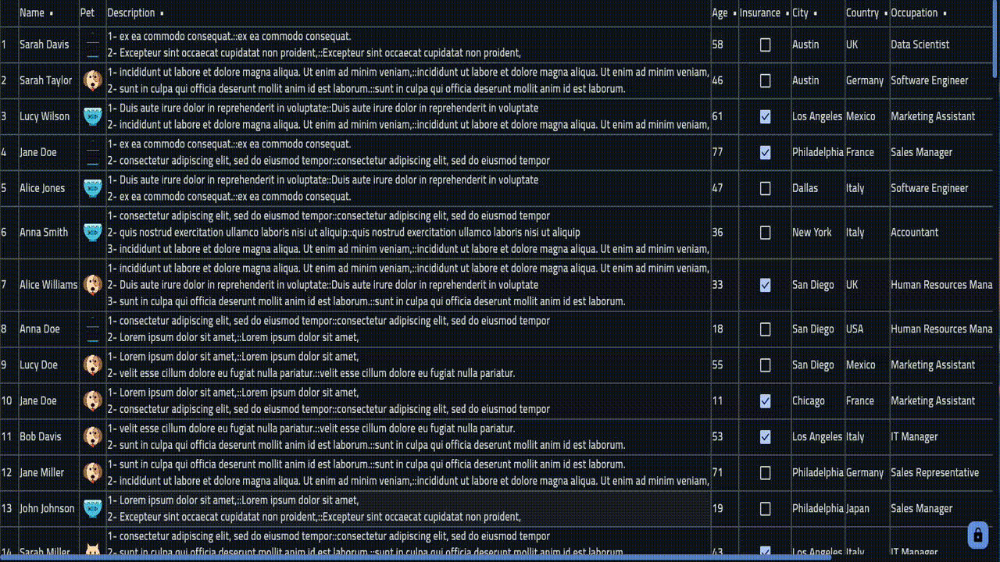
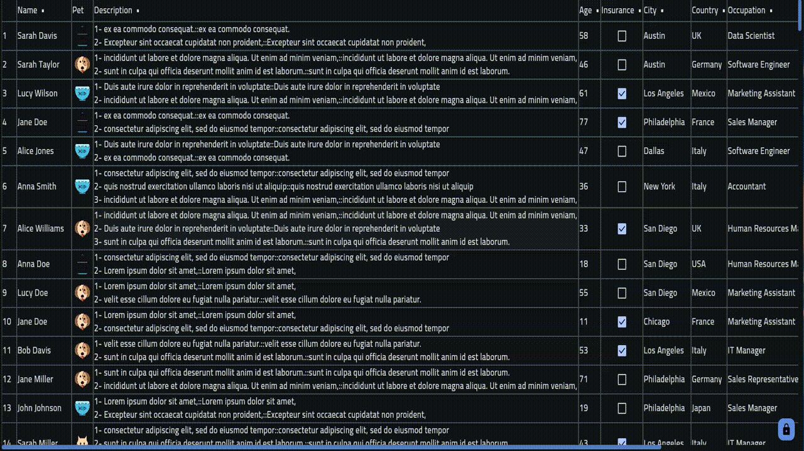
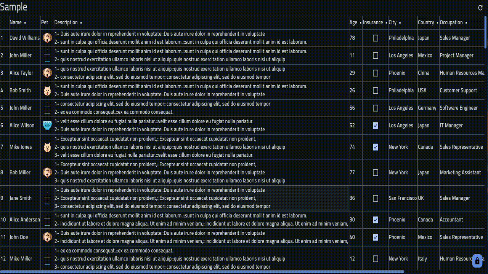
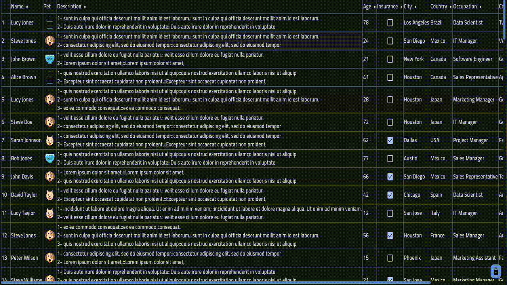

# Compose Table

A powerful and flexible data table implementation for Compose Multiplatform. Built to handle basic data visualization and manipulation needs across desktop, web, and mobile platforms (android & ios).

## Features

- **Responsive Layout**
  - Resizable columns with drag handles
  - Multiple column layout modes (Fixed, Scrollable, Weighted)
  - Sticky headers
  - Horizontal and vertical scrolling

- **Data Manipulation**
  - In-cell editing with validation and confirmation
  - Mobile-friendly edit dialog
  - Sort functionality on columns
  - Custom cell presentations
  - Comparable, text and composable column types
  - The ability to load more items when reaching the bottom of the table

- **Customization**
  - Keyboard navigation (Arrows and Tab keys)
  - Custom cell rendering
  - Theming support
  - Column alignment options
  - Configurable spacing and borders
  - Header customization
  - Ability to lock all interactions except for vertical scrolling

- **Performance**
  - Efficient list updates
  - Lazy loading support
  - Key-based optimization

## Installation

Add the dependency to your project:

```kotlin
// Kotlin multiplatform
kotlin {
    sourceSets {
        commonMain.dependencies {
            implementation("com.ryinex.kotlin:compose-data-table:<latest-version>")
        }
    }
}
```

## Tl;dr

### Playground
You can try the library in actual application: [CSV Viewer](https://csvviewer.ryinex.com)

### Basic Table

```kotlin
@Composable
private fun Table() {
    val scope = rememberCoroutineScope()
    val lazyState = rememberLazyListState()
    val config = DataTableConfig.default()
    val datatable = remember {
        val table = DataTable(config = config, scope = scope, lazyState = lazyState)

        table    
            .text(name = "Name", value = { index, person -> person.name })
            .text(name = "Age", value = { index, person -> person.age })
            .setList(list = Samples.persons(), key = { index, person -> person.id })
    }
    
    DataTableView(table = datatable)
}
```

### Embedded Table
This library provides a table that can be embedded into a LazyColumn but you must provide a horizontal scroll state yourself.
```kotlin
val scope = rememberCoroutineScope()
val lazyState = rememberLazyListState()
val config = DataTableConfig.default()
val horizontalScrollState = rememberScrollState()
val datatable = remember {
    val table = DataTable(config = config, scope = scope, lazyState = lazyState)

    table
        .text(name = "Name", value = { index, person -> person.name })
        .text(name = "Age", value = { index, person -> person.age })
        .setList(list = Samples.persons(), key = { index, person -> person.id })
}

Column {
    LazyColumn {
        item { /* item */ }
        item { /* item */ }
        
        EmbeddedDataTableView(horizontalScrollState, table)
        
        item { /* item */ }
    }
    
    // Optional horizontal scrollbar but it would make a better experience
    DataTableHorizontalScrollbar(state = horizontalScrollState)
}

```

## Screenshots

### Keyboard Navigation


### Sorting


### Resizing


### Editing


### Custom Cell Rendering


### Loading More Items


## Advanced

### Comparable Columns
Comparable columns are columns that can be sorted by clicking on the column header.                    
The `value` must return be of type `Comparable<T>` interface, most primitive types are comparable like string, boolean, numbers but this interface can be applied to any custom class as well.                        
Comparable columns takes their own composable views for rendering the cell content.             
In the below example, double clicking the header will sort the column ascending or descending depending if the value of `Boolean` type is `true` or `false`.

```kotlin
table
    .comparable(
        name = "Insurance",
        value = { index, data -> data.insurance },
        content = { index, value /* Boolean */ -> Checkbox(checked = value, onCheckedChange = null) }
    )
```

### Text Columns
By default text columns are comparable, so double click header to sort ascending or descending will work.

```kotlin
table
    .text(
        name = "Vote ability",
        textMapper = { value /* Boolean */ -> if (value == true) "Can vote" else "Can't vote" },
        value = { index, data -> data.age >= 18 }
    )
    .text(
        name = "Name",
        value = { index, data -> data.name } // textMapper returns { value.toString() } by default
    )
```

Text columns takes an DataTableEditTextConfig object to configure the text field.        
```kotlin
data class DataTableEditTextConfig<VALUE, DATA : Any>(
    val isEditable: Boolean,
    val saveTrigger: List<DataTableSaveTrigger>,
    val saveConfirm: DataTableSaveConfirm,
    val mobileEditConfig: DataTableMobileTextEdit,
    val keyboardOptions: KeyboardOptions,
    val inputTransformation: InputTransformation?,
    val outputTransformation: OutputTransformation?,
    val lineLimits: TextFieldLineLimits,
    val maxLines: Int,
    val onConfirmEdit: suspend (data: DATA, old: VALUE, text: String) -> VALUE?
)

enum class DataTableSaveTrigger {
    LEAVE_FOCUS,
    ENTER_PRESS
}

sealed interface DataTableSaveConfirm {
    data object Auto : DataTableSaveConfirm

    data class Dialog<VALUE, DATA : Any>(
        val content: @Composable (data: DATA, oldValue: VALUE, text: String, onCancel: () -> Unit, onConfirm: () -> Unit) -> Unit
    ) : DataTableSaveConfirm
}

sealed interface DataTableMobileTextEdit {
    data object InPlace : DataTableMobileTextEdit

    data class Dialog(
        val textFieldHint: @Composable () -> String,
        val content: @Composable (textField: @Composable () -> Unit, onCancel: () -> Unit, onConfirm: () -> Unit) -> Unit
    ) : DataTableMobileTextEdit
}
```
Most these data classes comes with `default` opinionated implementations that can be modified to config the edit properties of the column.                    
the `onConfirmEdit` lambda is called when the `DataTableSaveConfirm` is triggered it gives you the old value and the current text in the cell and it's up to you to confirm that the current text in the cell is valid so you return the text casted as `VALUE` or return `null` to cancel the edit.           
On mobile devices or mobile browsers, editing cell in place can be inconvenient so we provide a popup dialog you provide to edit the text more.              
Triggering saving the edit can be done in two ways `Leaving the focus of the cell` or `Pressing enter / Action button on softkeyboard on mobile devices`.                    
To confirm saving the edit this can be done in two ways `Auto` or popup `Dialog` you provide to confirm intention.
```kotlin
val editConfig = remember {
    DataTableEditTextConfig.default<Any, Any>(
        isEditable = true,
        saveConfirm = DataTableSaveConfirm.Dialog<Any, Any> { _, _, _, onCancel, onConfirm -> SaveChangesDialog(onCancel, onConfirm) },
        mobileBrowserEditConfig = DataTableMobileTextEdit.Dialog(
            textFieldHint = { "Your input" },
            content = { field, cancel, confirm -> MobileChangesDialog(textField = field, onCancel = cancel, onSave = confirm) }
        )
    )
}

table
    .text(
        name = "Salary",
        editTextConfig = editConfig.copy(onConfirmEdit = { index, old, text -> if (!text.isValidPositiveSalary()) null else text.asSalary() /* Double */ }),
        value = { index, data -> data.salary /* Double */ }
    )

@Composable
internal fun MobileChangesDialog(textField: @Composable () -> Unit, onCancel: () -> Unit, onSave: () -> Unit) {
    Card {
        /* 
        Custom content
         */
        textField() // Important
        Button(onClick = onCancel) { /* Button or whatever composable you choose to cancel the edit */ }
        Button(onClick = onSave) { /* Button or whatever composable you choose to save the edit */ }
    }
}

@Composable
private fun SaveChangesDialog(onCancel: () -> Unit, onConfirm: () -> Unit) {
    Card {
        /* 
        Custom content
         */
        Button(onClick = onCancel) { /* Button or whatever composable you choose to cancel the edit */ }
        Button(onClick = onConfirm) { /* Button or whatever composable you choose to confirm the edit */ }
    }
}
```

### Composable Columns

Composable columns are columns that are rendered as a composable with no sorting or editing functionality.

```kotlin
table
    .composable(
        name = "Pet",
        content = { index, data -> Image(painter = painterResource(data.pet), contentDescription = null) }
    )
```

## Configuration Classes

### DataTableConfig
Core configuration for the data table:
```kotlin
DataTableConfig.default(
    verticalSpacing = 4,              // Spacing between rows
    horizontalSpacing = 8,            // Spacing between columns
    isIndexed = true,                 // Show row indices
    isHeadered = true,                // Show column headers
    isHeaderSticky = true,            // Keep headers visible while scrolling
    column = { it }                   // Column configuration
)
```

### DataTableColumnLayout
Controls how columns are sized and arranged:
```kotlin
DataTableColumnLayout.FixedEquals        // Equal width columns
DataTableColumnLayout.FixedWighted       // Width based on weights
DataTableColumnLayout.ScrollableKeepInitial    // Scrollable with keeping initial largest width fixed between header and first cell
DataTableColumnLayout.ScrollableKeepLargest    // Scrollable with keeping largest width based on the largest cell width in the column
```

### DataTableColumnConfig
Configures individual column behavior:
```kotlin
DataTableColumnConfig(
    layout = DataTableColumnLayout.ScrollableKeepInitial,
    weight = 1f,                      // Column weight for FixedWighted layout
    isResizable = true,               // Enable column resizing
    resizeHandleColor = Color.Gray,   // Color of resize handle
    cell = DataTableCellConfig()      // Cell configuration
)
```

### DataTableCellConfig
Controls cell appearance and behavior:
```kotlin
DataTableCellConfig(
    modifier = Modifier,
    color = Color.Black,              // Text color
    backgroundColor = Color.White,     // Cell background
    shape = RectangleShape,           // Cell shape
    padding = PaddingValues(8.dp),    // Cell padding
    textStyle = TextStyle(),          // Text styling
    isForceLtr = false,              // Force left-to-right text
    enterFocusChild = true,          // Focus behavior
    alignment = Alignment.CenterStart, // Content alignment
    textAlign = TextAlign.Start       // Text alignment
)
```


## License

Apache License 2.0 - See [LICENSE](LICENSE) for details.
